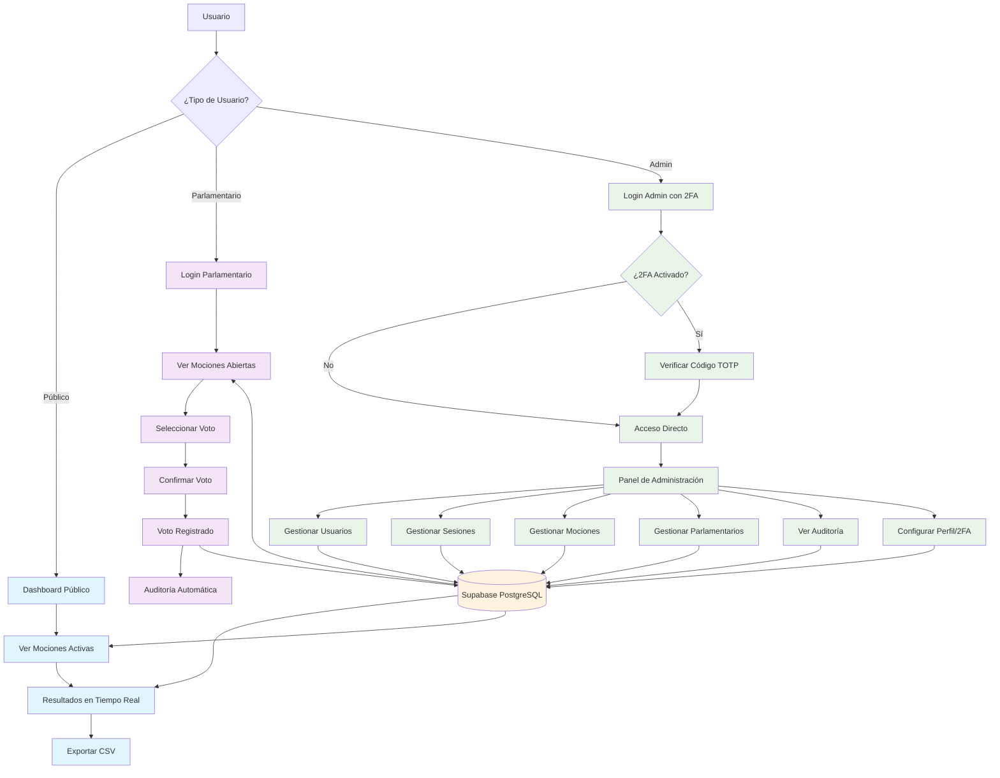
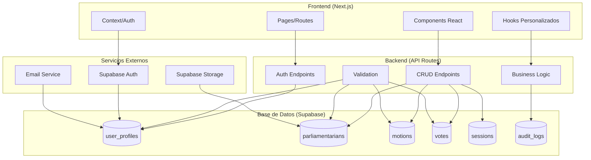
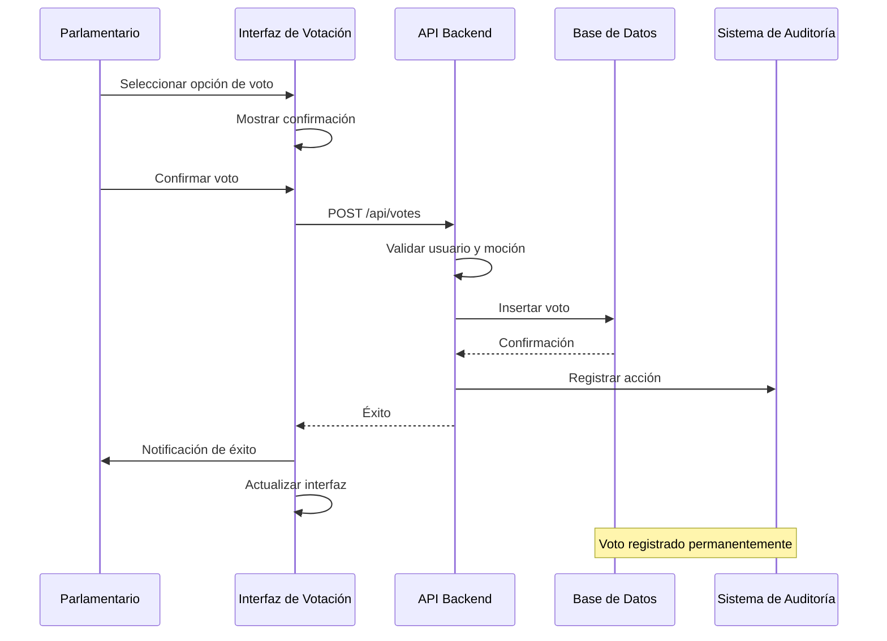
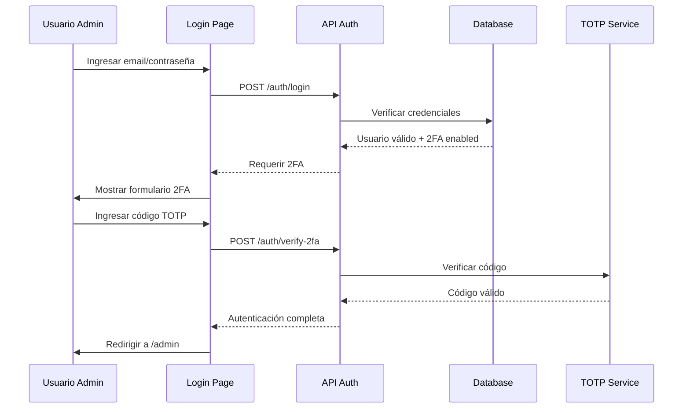

## 🏗️ Arquitectura Técnica



## 🔄 Flujo de Votación Detallado



## 🔐 Flujo de Autenticación con 2FA



## 📊 Flujo de Cálculo de Quórum

```mermaid
flowchart TD
    A[Consulta de Resultados] --> B[Obtener Total Parlamentarios Activos]
    B --> C[Calcular Quórum = MAX(50% + 1, 50)]
    C --> D[Contar Votos Presentes]
    D --> E{¿Votos Presentes >= Quórum?}
    E -->|Sí| F[Quórum Alcanzado ✓]
    E -->|No| G[Quórum No Alcanzado ✗]
    F --> H[Mostrar Resultados Válidos]
    G --> I[Mostrar Advertencia]
    H --> J[Permitir Decisión]
    I --> K[Esperar Más Votos]

    classDef success fill:#d4edda
    classDef warning fill:#f8d7da
    classDef process fill:#cce5ff

    class F,H,J success
    class G,I,K warning
    class A,B,C,D,E process
```